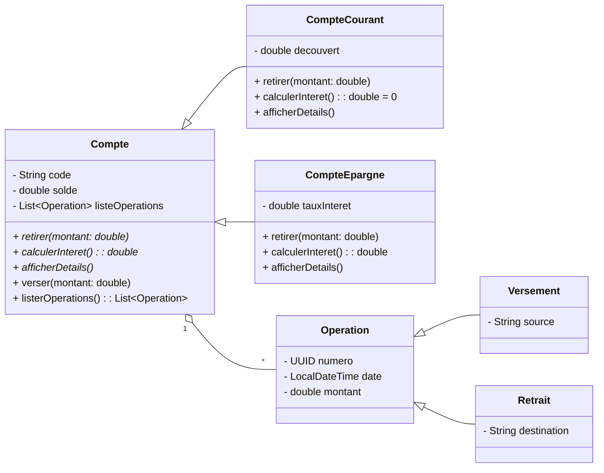
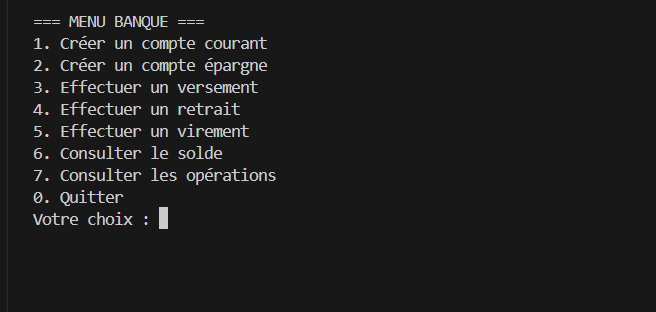
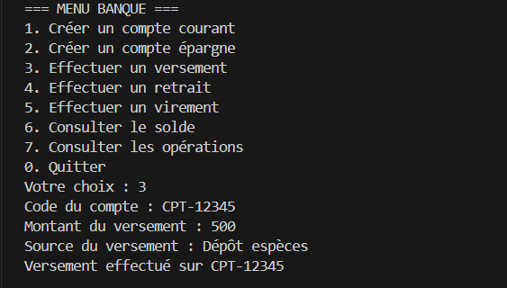
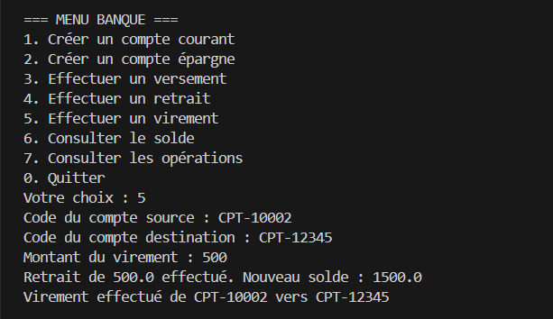

# 💳 Gestion des Comptes Bancaires — Application Console Java

Application console en Java 8 permettant de gérer des comptes bancaires (création, versements, retraits, virements) avec suivi des opérations et validations métier.

- 📦 Dépôt: [HamzaBraik01/Gestion-Comptes-Bancaires](https://github.com/HamzaBraik01/Gestion-Comptes-Bancaires) (branche: `main`)
- 🧠 Langage principal: Java
- 💾 Persistance: en mémoire (pas de base de données)

<p align="left">
  
  
  
</p>

---

## 🧭 Sommaire

- [🎯 Contexte et objectifs](#-contexte-et-objectifs)
- [✨ Fonctionnalités](#-fonctionnalités)
- [🧠 Règles métier et validations](#-règles-métier-et-validations)
- [🛠️ Technologies utilisées](#️-technologies-utilisées)
- [🧱 Architecture en couches](#-architecture-en-couches)
- [📂 Structure du projet](#-structure-du-projet)
- [⚙️ Prérequis](#️-prérequis)
- [▶️ Installation et exécution](#️-installation-et-exécution)
- [🧪 Exemples d’utilisation (menu)](#-exemples-dutilisation-menu)
- [🖼️ Captures d’écran](#-captures-décran)
- [⚠️ Qualité, erreurs et exceptions](#️-qualité-erreurs-et-exceptions)

---

## 🎯 Contexte et objectifs

Une banque souhaite automatiser la gestion de ses comptes via un système informatisé.  
Objectif: développer une application console (Java 8) pour gérer efficacement les comptes et leurs opérations:
- Versements, retraits, virements.
- Consultation des soldes et des historiques d’opérations.
- Respect strict des règles métier selon le type de compte.

---

## ✨ Fonctionnalités

- 👤 Création de compte:
  - Compte courant (avec découvert autorisé).
  - Compte épargne (avec taux d’intérêt).
- ➕ Effectuer un versement.
- ➖ Effectuer un retrait.
- 🔁 Effectuer un virement entre deux comptes.
- 💹 Consulter le solde d’un compte.
- 🧾 Lister les opérations d’un compte (date, montant, libellé).

---

## 🧠 Règles métier et validations

- 🧾 Format du code compte: `CPT-XXXXX` (5 chiffres)  
  Regex: `^CPT-\d{5}$`
- 🏦 Compte courant:
  - Intérêts: 0.
  - Retrait: solde final ≥ `-découvert`.
- 💰 Compte épargne:
  - Intérêts: calculés via `tauxInteret`.
  - Retrait: autorisé si `solde ≥ montant`.
- 🔄 Virement:
  - Débit du compte source (règles de retrait du compte).
  - Crédit du compte cible (versement).
  - Annulation si le retrait échoue.
- ✅ Validations:
  - Montants strictement positifs.
  - Code de compte conforme.
  - Existence des comptes avant opérations.
  - Identifiants d’opérations via `UUID`.
- 🕒 Dates:
  - `LocalDateTime.now()` (Java Time API) pour les opérations.

---

## 🛠️ Technologies utilisées

- Java 8+
- Collections: `ArrayList`, `HashMap`
- Java Time API (`java.time`)
- `UUID` (identifiants d’opérations)
- `Scanner` (I/O console)
- Regex (validation du code de compte)

---

## 🧱 Architecture en couches

- 👁️ Présentation (UI/Menu): interaction console, saisie/affichage, navigation.
- 🧩 Domaine/Métier: classes Compte, Opération, règles de retrait/virement/intérêts.
- 🗄️ Stockage en mémoire: gestion des comptes (`HashMap`) et opérations (`ArrayList`).
- 🧰 Utilitaires: validations, formatage, helpers console.

Diagramme (UML):


---

## 📂 Structure du projet

- `src/` — Code source Java de l’application.
- `docs/screenshots/` — Captures d’écran (à créer).
- `README.md` — Documentation du projet.

Note: l’application fonctionne en mode console et stocke les données en mémoire durant l’exécution.

---

## ⚙️ Prérequis

- Java JDK 8+ installé (recommandé: Java 8)
- Git (pour cloner le dépôt)
- Un terminal/Invite de commandes

---

## ▶️ Installation et exécution

1) Cloner le dépôt
```bash
git clone https://github.com/HamzaBraik01/Gestion-Comptes-Bancaires.git
cd Gestion-Comptes-Bancaires
```

2) Compiler et exécuter (sans outil de build)

macOS/Linux:
```bash
mkdir -p out
find src -name "*.java" > sources.txt
javac -d out @sources.txt
# Remplacez com.bank.ui.Main par votre classe Main
java -cp out com.bank.ui.Main
```

Windows (PowerShell):
```powershell
New-Item -ItemType Directory -Force -Path out | Out-Null
$sources = Get-ChildItem -Recurse -Filter *.java -Path src | ForEach-Object { $_.FullName }
javac -d out $sources
# Remplacez com.bank.ui.Main par votre classe Main
java -cp out com.bank.ui.Main
```

Si vos classes ne sont pas dans un package, lancez:
```bash
java -cp out Main
```

---

## 🧪 Exemples d’utilisation (menu)

Exemple de menu:
```
=== Gestion des Comptes Bancaires ===
1. Créer un compte
2. Effectuer un versement
3. Effectuer un retrait
4. Effectuer un virement
5. Consulter le solde d'un compte
6. Lister les opérations d'un compte
0. Quitter
Votre choix: _
```

Création de compte courant:
```
Type de compte (1=Courant, 2=Épargne): 1
Code (format CPT-12345): CPT-12345
Solde initial: 1500
Découvert autorisé: 300
[OK] Compte courant CPT-12345 créé (solde: 1500.00, découvert: 300.00)
```

Versement:
```
Code du compte: CPT-12345
Montant (positif): 250
Source (ex: Salaire, Dépôt espèces): Salaire
[OK] Versement de 250.00 sur CPT-12345 (source: Salaire)
Nouveau solde: 1750.00
```

Retrait (compte courant avec découvert):
```
Code du compte: CPT-12345
Montant (positif): 1800
Destination (ex: Distributeur ATM): Distributeur ATM
[OK] Retrait de 1800.00. Solde final: -50.00 (plafond découvert: -300.00)
```

Virement:
```
Compte source: CPT-12345
Compte cible: CPT-67890
Montant (positif): 200
[OK] Virement de 200.00 de CPT-12345 vers CPT-67890
```

Historique:
```
--- Opérations du compte CPT-12345 ---
[2025-09-19 12:10] Versement 250.00 (source: Salaire)  # UUID: ...
[2025-09-19 12:15] Retrait   1800.00 (dest: Distributeur ATM)  # UUID: ...
Solde actuel: -50.00
```

---

## 🖼️ Captures d’écran

Placez vos images dans `docs/screenshots/` et référencez-les ici:

- 🧭 Menu principal  
  

- 💵 Exemple de versement  
  

- 🔁 Exemple de virement  
  

---

## ⚠️ Qualité, erreurs et exceptions

- Validations d’entrée:
  - Montants: `> 0`
  - Codes comptes: `^CPT-\d{5}$`
  - Existence des comptes avant opérations.
- Gestion des exceptions:
  - `try/catch` autour des I/O console.
  - Messages utilisateur clairs (format invalide, compte introuvable, retrait impossible, etc.).
- Conventions:
  - Nommage clair, méthodes courtes, séparation stricte des couches.